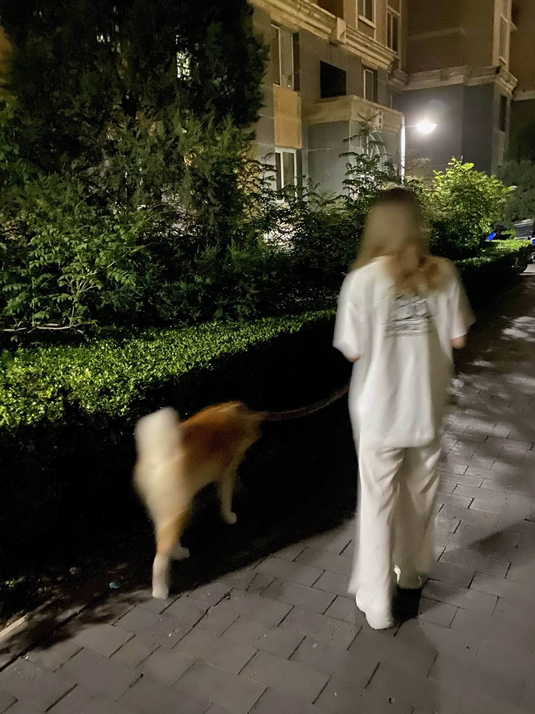

## 🎉 Hi!~

#### 
I love my girl friend and coding,hhha!~

#### 
email: zhaodonghao586@outlook.com

<!--  -->

## 🔧 My project

  

## 🤓 My values
🍏 Beginner's mindset and curiosity 
🙌 Sharing anything I learned 

## 🔭 Goals of 2021

I'm learning English now. I watch English channels and articles everyday and practice writing English articles about sharing programming technology each week. I hope I can be prepared in 2021 💪. I plan to contribute more open-source projects to improve my programming skill.

## 🧠 That I know and use

<code></code>

## 📝 My GH stats

